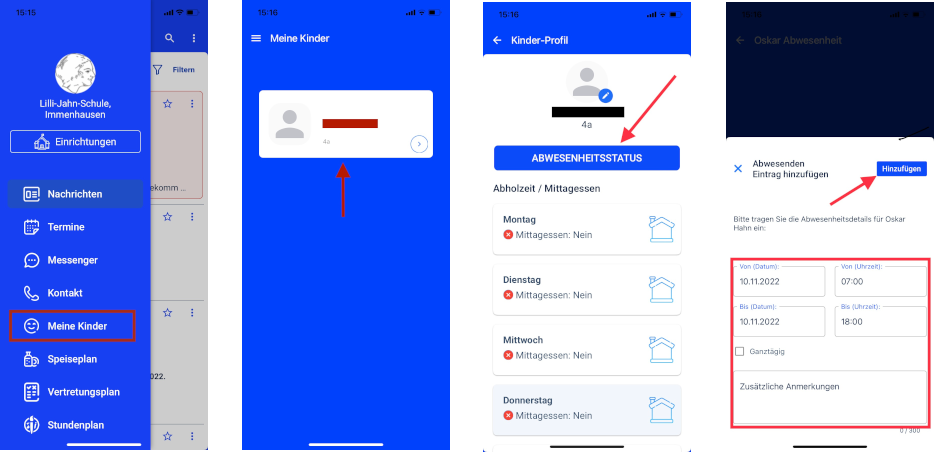



Seit dem Sommer 2022 wird an der Lilli-Jahn-Schule die Stay-Informed App verwendet, um die Kommunikation zwischen Schule und Eltern zu erleichtern. Dies umfasst Nachrichten an Sie als Eltern, Einverständniserklärungen, aber auch den Abwesendheitsstatus Ihres Kindes. Die App dürfte vielen Eltern bereits durch den Kindergarten "Kleine Immen" in Immenhausen bekannt sein.

Laden Sie sich die App im Apple App Store oder im Google Play Store gratis herunter. Nutzen sie dafür die Links zu den App Stores oder suchen nach **Stay Informed**.

Wenn Sie ein Konto erstellen, geben sie die folgende Einrichtungs-ID ein:

    Einrichtungs-ID:  js81499249

    
    

#### Weitere Downloads

- <a href="Anleitung NutzerInnen-Registrierung Deutsch.pdf" target="_blank" class="pdf-document"><i data-feather="file-text"></i> Anleitung zur Registrierung auf Deutsch</a>
- <a href="Datenschutz Schul-Info-App.pdf" target="_blank" class="pdf-document"><i data-feather="file-text"></i> Datenschutzinformationen zur Stay Informed App</a>
- <a href="Infoplakat.pdf" target="_blank" class="pdf-document"><i data-feather="file-text"></i> Infoplakat</a>
- <a href="Інструкції - Anleitung NutzerInnen Registrierung UKR.pdf" target="_blank" class="pdf-document"><i data-feather="file-text"></i> UKR Registrierung Stay Informed App</a>

### Abwesendheitsstatus Ihres Kindes

Ihr Kind können sie ganz einfach über die StayInformed-App vom Schulunterricht abmelden. Dafür gehen Sie in der App auf den Menüpunkt **"Meine Kinder"**, wählen das entsprechende Kind aus und fügen einen **Abwesenheitsstatus** hinzu.

    Wenn die Kinder wieder gesund und in der Schule sind ist eine schriftliche Entschuldigung mitgebracht werden. Der Anruf im Sekretariat entfällt jedoch.

    

        

            <svg xmlns="http://www.w3.org/2000/svg" width="100%" height="auto" fill="currentColor" class="bi bi-bag-heart" viewBox="0 0 16 16">
                <path fill-rule="evenodd" d="M10.5 3.5a2.5 2.5 0 0 0-5 0V4h5v-.5Zm1 0V4H15v10a2 2 0 0 1-2 2H3a2 2 0 0 1-2-2V4h3.5v-.5a3.5 3.5 0 1 1 7 0ZM14 14V5H2v9a1 1 0 0 0 1 1h10a1 1 0 0 0 1-1ZM8 7.993c1.664-1.711 5.825 1.283 0 5.132-5.825-3.85-1.664-6.843 0-5.132Z">
            </svg>
        

        

            Die App wird der Schule vom Förderverein der Lilli-Jahn-Schule bereitgestellt. Mit ihrer Mitgliedschaft im Förderverein unterstützen sie unter anderem die laufenden Kosten der Lizenzgebühren.
        

    

### Wissenswertes zum Umgang mit dem Internet

Ein sicherer Umgang mit dem Internet setzt Wissen voraus. Die Internet-Seite <a href="https://www.internet-abc.de/" target="_blank">https://www.internet-abc.de</a> vermittelt Grundschulkindern dieses Wissen auf spielerische Art und Weise.
