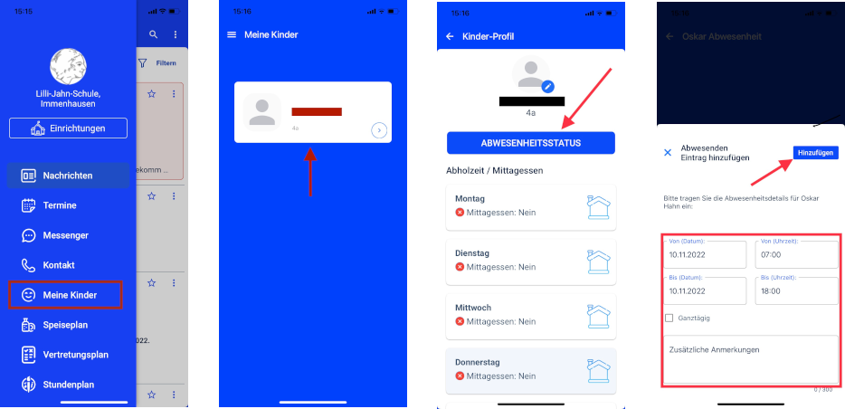

## Wann darf mein Kind wieder in die Schule?

Das Gesundheitsamt der Region Kassel hat in Zusammenarbeit mit dem Robert-Koch-Institut eine Tabelle erarbeitet, aus der hervorgeht, ab wann ein Kind nach Krankheit wieder in die Schule darf. 

<a href="https://www.kassel.de/buerger/gesundheit/kinder_und_jugendgesundheit/wiederzulassungstabelle-fuer-gemeinschaftseinrichtungen.php" target="_blank">Wiederzulassungstabelle für Gemeinschaftseinrichtungen</a>

### Abwesendheitsstatus Ihres Kindes

Ihr Kind können Sie ganz einfach über die StayInformed-App vom Schulunterricht abmelden. Dafür gehen Sie in der App auf den Menüpunkt **"Meine Kinder"**, wählen das entsprechende Kind aus und fügen einen **Abwesenheitsstatus** hinzu.

    Wenn die Kinder wieder gesund und in der Schule sind, muss eine schriftliche Entschuldigung mitgebracht werden. Der Anruf im Sekretariat entfällt jedoch.

